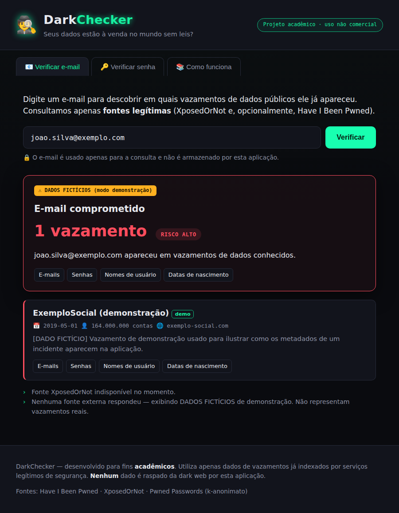
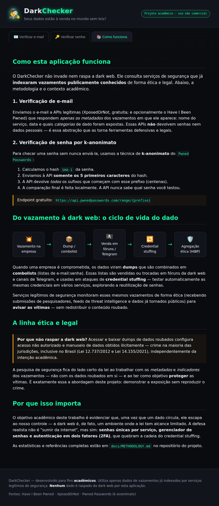

# 🕵️ DarkChecker

**Verificador de vazamento de dados por e-mail e senha — projeto acadêmico.**

O DarkChecker permite descobrir se um e-mail apareceu em vazamentos de dados
conhecidos e se uma senha já foi comprometida, usando **exclusivamente fontes
legítimas e legais** de threat intelligence. Ele foi construído para um trabalho
de faculdade cujo objetivo é evidenciar que **dados vazados circulam livremente
e que estamos expostos a isso** — demonstrando o problema **e** a resposta ética
a ele.

> ⚠️ **Uso não comercial e educacional.** Este projeto **não** faz *crawling* da
> dark web nem manipula dados roubados. Ele consulta serviços que já indexaram
> vazamentos publicamente conhecidos de forma legal. Ver
> [`docs/ETHICS.md`](docs/ETHICS.md).

---

## 📸 Telas

| Verificação de e-mail | Painel educacional |
|---|---|
|  |  |

---

## ✨ Funcionalidades

- **Verificação de e-mail** em vazamentos conhecidos, cruzando **duas fontes
  gratuitas** (*XposedOrNot* + *LeakCheck*) e, opcionalmente, *Have I Been
  Pwned* — triangulação de fontes sem manipular dados roubados.
- **Verificação de senha por k-anonimato** (*Pwned Passwords*): a senha **nunca**
  é enviada pela rede — só os 5 primeiros caracteres do hash SHA-1.
- **Nível de risco** e agregação de fontes, com deduplicação de vazamentos.
- **Painel educacional** explicando a metodologia, o ciclo de vida do dado e a
  linha ética/legal — pronto para a apresentação.
- **Modo demonstração**: funciona offline com dados fictícios claramente
  rotulados, caso as APIs externas estejam indisponíveis.
- **Sem custo obrigatório**: roda inteiramente com APIs gratuitas, sem chave.

---

## 🚀 Como executar

### Opção A — script automático (Linux/macOS)

```bash
./run.sh
```

Depois abra <http://127.0.0.1:8000> no navegador.

### Opção B — manual

```bash
# 1. Ambiente virtual + dependências
python3 -m venv .venv
source .venv/bin/activate           # Windows: .venv\Scripts\activate
pip install -r requirements.txt

# 2. Configuração (opcional — a app funciona sem chaves)
cp .env.example .env

# 3. Subir o servidor
uvicorn backend.main:app --reload
```

Acesse <http://127.0.0.1:8000>. A documentação interativa da API (Swagger) fica
em <http://127.0.0.1:8000/docs>.

---

## ⚙️ Configuração

Todas as variáveis são opcionais (ver [`.env.example`](.env.example)):

| Variável | Padrão | Descrição |
|---|---|---|
| `HIBP_API_KEY` | *(vazio)* | Chave paga do HIBP. Habilita a verificação de e-mail via HIBP, além das fontes gratuitas. |
| `HIBP_USER_AGENT` | `DarkChecker-Academic-Project` | User-Agent exigido pela API do HIBP. |
| `XPOSEDORNOT_ENABLED` | `true` | Ativa a fonte gratuita XposedOrNot. |
| `LEAKCHECK_ENABLED` | `true` | Ativa a fonte gratuita LeakCheck. |
| `DEMO_FALLBACK` | `true` | Se `true`, usa dados fictícios quando as APIs externas falham. |
| `HTTP_TIMEOUT` | `10` | Timeout (s) das chamadas externas. |

---

## 🔌 Endpoints da API

| Método | Rota | Descrição |
|---|---|---|
| `GET`  | `/api/health` | Estado da aplicação e integrações habilitadas. |
| `POST` | `/api/check/email` | Verifica um e-mail. Corpo: `{"email": "..."}`. |
| `POST` | `/api/check/password` | Verifica uma senha (k-anonimato). Corpo: `{"password": "..."}`. |
| `GET`  | `/` | Interface web. |

Exemplo:

```bash
curl -X POST http://127.0.0.1:8000/api/check/password \
  -H "Content-Type: application/json" \
  -d '{"password":"123456"}'
```

---

## 🧪 Testes

Os testes simulam as APIs externas (via `respx`), então rodam **offline** e de
forma determinística:

```bash
source .venv/bin/activate
pytest -q
```

---

## 🏗️ Arquitetura

```
darkchecker/
├── backend/                 # API FastAPI (Python)
│   ├── main.py              # Endpoints + serve o frontend
│   ├── config.py            # Configuração (.env)
│   ├── schemas.py           # Modelos Pydantic (request/response)
│   └── services/
│       ├── passwords.py     # k-anonimato (Pwned Passwords)
│       ├── hibp.py          # Have I Been Pwned (opcional)
│       ├── xposedornot.py   # Fonte gratuita de e-mail
│       ├── leakcheck.py     # Fonte gratuita de e-mail (cruza com XposedOrNot)
│       ├── demo_data.py     # Dados fictícios (modo demo)
│       └── aggregator.py    # Orquestra fontes, dedup, risco
├── frontend/                # SPA em HTML/CSS/JS puro (sem build)
│   ├── index.html
│   ├── styles.css
│   └── app.js
├── tests/                   # Testes unitários (pytest + respx)
├── docs/
│   ├── METHODOLOGY.md       # Metodologia + fundamentação acadêmica
│   ├── ETHICS.md            # Declaração de ética
│   └── images/              # Capturas de tela
├── requirements.txt
├── run.sh
└── .env.example
```

**Fluxo de uma verificação de e-mail:** o `aggregator` consulta a fonte gratuita
(XposedOrNot) e, se houver chave, o HIBP; normaliza e deduplica os vazamentos;
calcula um nível de risco a partir da quantidade e da sensibilidade dos dados
expostos; e recorre ao modo demonstração apenas se nenhuma fonte responder.

---

## 📚 Fundamentação acadêmica

A metodologia técnica completa, o ciclo de vida do dado vazado, a análise legal
(CFAA, LGPD, Leis 12.737/2012 e 14.155/2021) e as **estatísticas citáveis** com
fontes estão em **[`docs/METHODOLOGY.md`](docs/METHODOLOGY.md)** — o material de
base para a monografia.

---

## ⚖️ Ética

Ver **[`docs/ETHICS.md`](docs/ETHICS.md)**. Em resumo: só metadados, só fontes
legítimas, senha nunca transmitida, nada raspado da dark web. Consulte apenas o
seu próprio e-mail ou o de quem consentiu.

---

## 🛡️ Como se proteger (a lição prática)

A defesa realista contra o *credential stuffing* que a dark web viabiliza:

1. **Senhas únicas** por serviço.
2. **Gerenciador de senhas** (para viabilizar o item 1).
3. **Autenticação em dois fatores (2FA/MFA)** — quebra a cadeia do ataque mesmo
   com a senha vazada.
